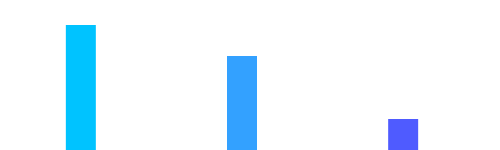
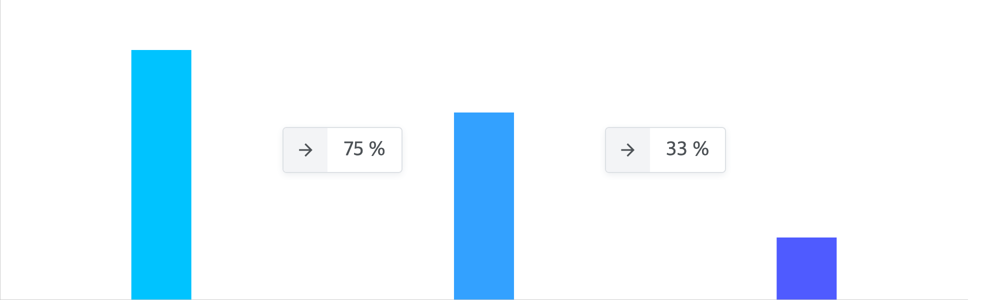

# Representation
[](https://lernajs.io/)
> extensible react chart library

# Usage
First, install necessary packages.
e.g. If you need bar chart and axis then
```
npm install --save @representation/bar
npm install --save @representation/axis
```
Or
```
yarn add @representation/bar
yarn add @representation/axis
```

## BarChart and Axis
```jsx
import React from 'react'
import { BarChart, Bar } from '@representation/bar'
import { XAxis, YAxis } from '@representation/axis'

function Chart() {
  return (
    <BarChart
      data={{ a: 400, b: 300, c: 100 }}
      width={1000}
      height={300}
    >
      <Bar dataKey="a" fill="#00c3ff" />
      <Bar dataKey="b" fill="rgba(0, 138, 255, 0.8)" />
      <Bar dataKey="c" fill="#4f5bff" />
      <YAxis stroke="#ccc" />
      <XAxis stroke="#ccc" />
    </BarChart>
  )
}
```
Result:


## With Custom Children
If you want make custom chart children then install `@representation/core`
```
npm install --save @representation/core
```
Or
```
yarn add @representation/core
```

Then, use `withChart` and `this.props.chart` to get the chart data you need.
For example, `getBarXPosition` return the x-axis position of the bar of the dataKey.

So if you want to put your the custom child in the middle of the two bars, write the code like this:
```jsx
import { withChart } from '@representation/core'

function Step({ chart, fromDataKey, toDataKey, ...props }) {
  const fromPosition = chart.getBarXPosition(fromDataKey)
  const toPosition = chart.getBarXPosition(toDataKey)
  const xPosition = (fromPosition + toPosition) / 2

  return (
    <rect
      x={xPosition}
      {...props}
    />
  )
}

export default withChart(Step)
```

You can also use HTML tags with the svg foreignObject tag.
```jsx
import React from 'react'
import { withChart } from '@representation/core'
import numeral from 'numeral'

import styles from './Step.module.scss'

function Step({ chart, fromDataKey, toDataKey, width, onClick }) {
  const fromPosition = chart.getBarXPosition(fromDataKey)
  const toPosition = chart.getBarXPosition(toDataKey)
  const xPosition = (fromPosition + toPosition) / 2

  const fromData = chart.data[fromDataKey]
  const toData = chart.data[toDataKey]
  const rate = toData / fromData

  const height = 100

  return (
    <foreignObject
      x={(xPosition + height / 2) - (width / 2)}
      y={(chart.height / 2) - (height / 2)}
      width={width}
      height={height}
    >
      <div
        className={styles.step}
        onClick={onClick}
      >
        <div className={styles.content}>
          <div className={styles.arrow}>
            <i className="material-icons">
              arrow_forward
            </i>
          </div>
          <div className={styles.rate}>
            {numeral(rate).format('0 %')}
          </div>
        </div>
      </div>
    </foreignObject>
  )
}

export default withChart(Step)
```
Result:


For more information see [website/src/components/Step](./website/src/components/Step)

# Build
Requirements
* [yarn](https://yarnpkg.com)
```
yarn install
yarn bootstrap
yarn build
```

# License
[MIT](./LICENSE)
